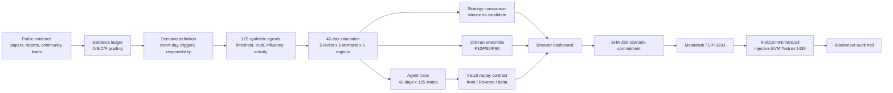

# Architecture

## Components

| Component | Responsibility |
| --- | --- |
| `src/model.js` | Seeded population, 42-day propagation, comparisons, ensembles and evidence readiness |
| `src/visualization-data.js` | Renderer-neutral board identities, per-agent visual frames, unavailable Reverse channels and strategy deltas |
| `scripts/run-visual-replay.js` | Deterministically generate the versioned baseline/candidate/delta JSON artifact for future 2D/3D clients |
| `src/injective.js` | Network configuration, deterministic hashing, wallet switching, calldata and runtime-code verification |
| `contracts/RiskCommitment.sol` | Emit scenario hash, coarse risk band, test-INJ pulse and same-transaction refund |
| `app.js` | Scenario controls, visualization, evidence view and wallet workflow |
| `research/` | Academic mapping, crisis ledger, search log, model card and chain-source verification |
| `tests/` | Unit, contract, browser-module and desktop/mobile E2E verification |

## Trust boundaries

The browser owns no signing key. MetaMask is the signing boundary. The user supplies a contract address, but the commit button remains disabled until `eth_getCode` exactly matches the compiled runtime bytecode. Transaction hashes are validated and rendered with DOM text nodes, not inserted as HTML.

The evidence ledger is separate from model parameters. A source can establish that an event or statement exists; it does not establish a numeric trigger coefficient. Parameters remain explicit experiment assumptions until historical backtesting is added.
