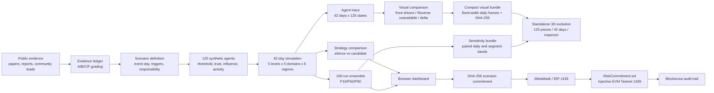

# Architecture

## Target AI compilation chain

```text
public URLs / checked local snapshots
        ↓
evidence-ledger/1.0 (sources, claims, grades, languages)
        ↓
AI extraction + theory-catalog/1.0 mapping
        ↓
compiled-scenario/1.0 (citations + explicit synthetic assumptions)
        ↓
hybrid Agent runtime (target) / current deterministic formula baseline
        ↓
agent trace → visual bundle → 3D observer
        ↓
run-manifest SHA-256 → Injective Testnet
```

AI exists only at the server-side or offline compilation boundary. The browser never receives a model key, and a model never supplies the final risk probability. `src/ai-provider.js`, `src/evidence-ledger.js`, and `src/scenario-compiler.js` now define the first half of this chain; the hybrid Agent runtime is still pending.



## Components

| Component | Responsibility |
| --- | --- |
| `src/evidence-ledger.js` | Validate public sources and claims, enforce evidence grades, and build bounded model input packs |
| `src/ai-provider.js` | Keep BYOK model credentials in Node and normalize live or recorded structured output provenance |
| `src/scenario-compiler.js` | Compile and validate evidence-bound synthetic scenarios before they enter the simulator |
| `src/model.js` | Seeded population, 42-day propagation, comparisons, ensembles and evidence readiness |
| `src/visualization-data.js` | Renderer-neutral board identities, per-agent visual frames, unavailable Reverse channels and strategy deltas |
| `src/visualization-bundle.js` | Fixed-width integer encoding, daily random access and browser decoding without simulation logic |
| `src/sensitivity-data.js` | Paired P10/P50/P90 encoding and browser decoding with unavailable-channel declarations |
| `scripts/run-data-beta04.js` | Deterministically generate Beta 0.4 replay, daily segment sensitivity data, byte length and SHA-256 manifest |
| `simulation/piece-geometries.js` | Five procedural piece silhouettes mapped to the five social levels |
| `simulation/scene.js` | Three.js instancing, 45-60 degree board, Reverse shadows, pressure, fragments, raycasting and pixel diagnostics |
| `simulation/app.js` | Manifest verification, 42-day replay, baseline/candidate/delta switching and source-day inspection |
| `src/injective.js` | Network configuration, deterministic hashing, wallet switching, calldata and runtime-code verification |
| `contracts/RiskCommitment.sol` | Emit scenario hash, coarse risk band, test-INJ pulse and same-transaction refund |
| `app.js` | Scenario controls, visualization, evidence view and wallet workflow |
| `research/` | Academic mapping, crisis ledger, search log, model card and chain-source verification |
| `tests/` | Unit, contract, browser-module and desktop/mobile E2E verification |

`simulation/` is a compatibility URL for the product surface that observes the full evolution process. Simulation is completed offline before the page opens; the browser replays the verified artifact and does not run the model. It has no dependency on `roadshow/`, and E2E tests reject any request whose URL contains `/roadshow/` while this route is open.

## Trust boundaries

The browser owns no signing key or model API key. MetaMask is the signing boundary. Model calls use server-side environment variables. The user supplies a contract address, but the commit button remains disabled until `eth_getCode` exactly matches the compiled runtime bytecode. Transaction hashes are validated and rendered with DOM text nodes, not inserted as HTML.

The evidence ledger is separate from model parameters. A source can establish that an event or statement exists; it does not establish a numeric trigger coefficient. Parameters remain explicit experiment assumptions until historical backtesting is added.

Model output is untrusted input. Citation IDs, theory IDs, numeric bindings, regional differences, strategy ranges, and the synthetic scenario marker are validated again before simulation. A non-neutral regional factor cannot be justified by a synthetic assumption.
