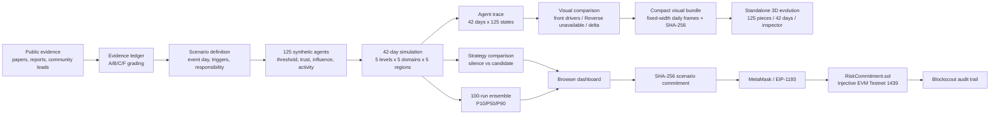

# Architecture

## Components

| Component | Responsibility |
| --- | --- |
| `src/model.js` | Seeded population, 42-day propagation, comparisons, ensembles and evidence readiness |
| `src/visualization-data.js` | Renderer-neutral board identities, per-agent visual frames, unavailable Reverse channels and strategy deltas |
| `src/visualization-bundle.js` | Fixed-width integer encoding, daily random access and browser decoding without simulation logic |
| `scripts/run-visual-bundle.js` | Deterministically generate Beta 0.2 plus its byte-length and SHA-256 manifest |
| `simulation/piece-geometries.js` | Five procedural piece silhouettes mapped to the five social levels |
| `simulation/scene.js` | Three.js instancing, 45-60 degree board, Reverse shadows, pressure, fragments, raycasting and pixel diagnostics |
| `simulation/app.js` | Manifest verification, 42-day playback, baseline/candidate/delta switching and source-day inspection |
| `src/injective.js` | Network configuration, deterministic hashing, wallet switching, calldata and runtime-code verification |
| `contracts/RiskCommitment.sol` | Emit scenario hash, coarse risk band, test-INJ pulse and same-transaction refund |
| `app.js` | Scenario controls, visualization, evidence view and wallet workflow |
| `research/` | Academic mapping, crisis ledger, search log, model card and chain-source verification |
| `tests/` | Unit, contract, browser-module and desktop/mobile E2E verification |

`simulation/` is a product surface for observing the full evolution process. It has no dependency on `roadshow/`, and E2E tests reject any request whose URL contains `/roadshow/` while this route is open.

## Trust boundaries

The browser owns no signing key. MetaMask is the signing boundary. The user supplies a contract address, but the commit button remains disabled until `eth_getCode` exactly matches the compiled runtime bytecode. Transaction hashes are validated and rendered with DOM text nodes, not inserted as HTML.

The evidence ledger is separate from model parameters. A source can establish that an event or statement exists; it does not establish a numeric trigger coefficient. Parameters remain explicit experiment assumptions until historical backtesting is added.
